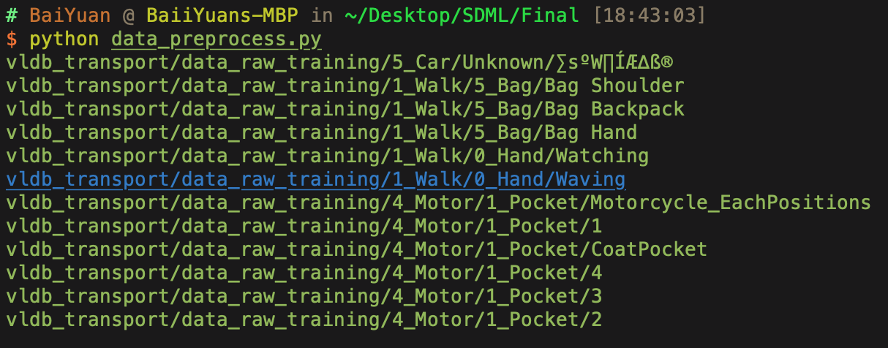

# SDML Final project - ReadMe

Code for the Final project

### Preprocessing



*(The first line is vldb_transport/data_raw_training/5_Car/Unknown/新增資料夾, which is empty. Please REMOVE it.)*


For the above files, which have five layers, please move them to the upper folder. Let all the files is under the four-layer-structutre.

First, move the folder `vldb_transport` into `preprocess`

```bash
cd preprocess
python3 data_preprocess.py
mkdir win128shi128
python3 data_more_process.py ./modify_vldb_transport ./win128shi128
```


### Attn-RNN

As following: 

```bash
cd Self_Attn
## Train and test
python3 main.py -dp ./win128shi128 -md ./model_1.tar -e 20 -lr 1e-4
## Test
python3 main.py -dp ../data/win128shi128 -md ./model_1.tar -tr 0
```


### Non-Local

As following:

```bash
cd Non_Local
## Train and test
python3 main.py -dp ./win128shi128 -md ./model_1.tar -e 20 -lr 1e-4
## Test
python3 main.py -dp ../data/win128shi128 -md ./model_1.tar -tr 0
```


### Xgboost

```bash
cd XGboost
```

